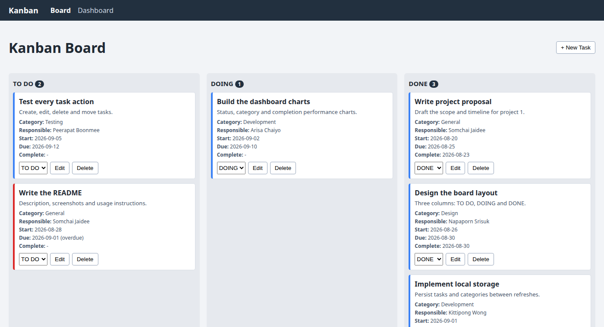
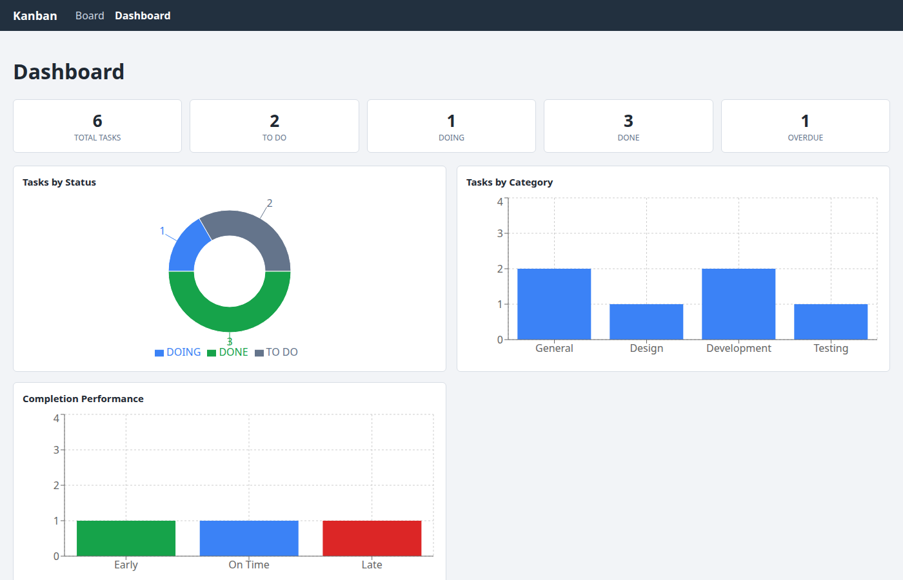

# Kanban Board with Dashboard

A React single-page application with a 3-column Kanban board and a summary
dashboard. All data is kept in the browser's **Local Storage** — there is no
backend, so the tasks and categories you create are still there after a refresh.

**Live demo:** https://minbanyartalahtaw.github.io/Web_Development_Project_1/

## Team Members

- 6715168 - Min Banyar Tala Htaw
- 6714506 - Sai Aung Nyunt

## Screenshots

### Kanban Board



### Dashboard



## Features

### Page 1 — Kanban Board

- Three columns: **TO DO**, **DOING** and **DONE**, each showing its task count
- Create, edit and delete tasks
- Move a task between columns from the dropdown on each card
- Moving a task to DONE stamps the complete date automatically; moving it back
  out clears the date again
- Each task holds a title, description, category, start date, due date,
  complete date, responsible person and status
- Overdue tasks (past the due date and not yet DONE) are marked in red
- Responsible people are a fixed list provided by the assignment

### Categories

- Pick an existing category when creating or editing a task
- Add a new category from inside the task form; it is saved and available for
  every future task

### Page 2 — Dashboard

- **Summary cards:** total tasks, TO DO, DOING, DONE and overdue counts
- **Tasks by Status:** doughnut chart
- **Tasks by Category:** bar chart
- **Completion Performance:** bar chart comparing Early / On Time / Late, based
  on each finished task's complete date against its due date

## Tech Stack

- React 19
- React Router (HashRouter, so GitHub Pages serves both pages correctly)
- Recharts for the dashboard charts
- Vite as the build tool
- Plain CSS

## Getting Started

```bash
npm install     # install dependencies
npm run dev     # start the dev server at http://localhost:5173
npm run build   # create a production build in dist/
npm run preview # preview the production build
```

## Usage

1. Open the app — the board starts with a few sample tasks.
2. Click **+ New Task**, fill in the form and press **Save**.
3. To add a category, type its name in the _New category_ box inside the form
   and click **Add category**; it is selected right away and stays available.
4. Use the dropdown on a card to move a task between TO DO, DOING and DONE.
   Moving it to DONE records today's date as the complete date.
5. Use **Edit** to change a task or **Delete** to remove it.
6. Open **Dashboard** in the top navigation to see the summary cards and charts.
7. Refresh the page — everything is restored from Local Storage.

## Deploying to GitHub Pages

```bash
npm run deploy
```

This builds the app and pushes `dist/` to the `gh-pages` branch. Then, in the
repository settings, set **Pages → Source** to the `gh-pages` branch.
